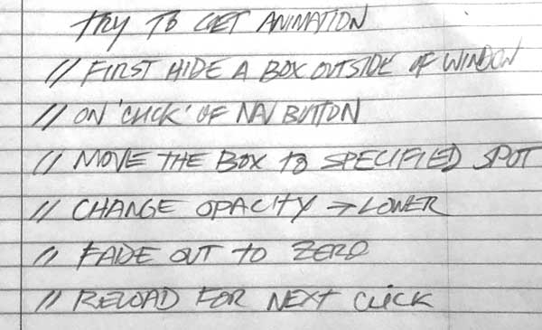
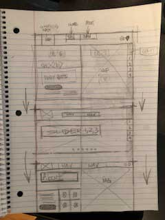
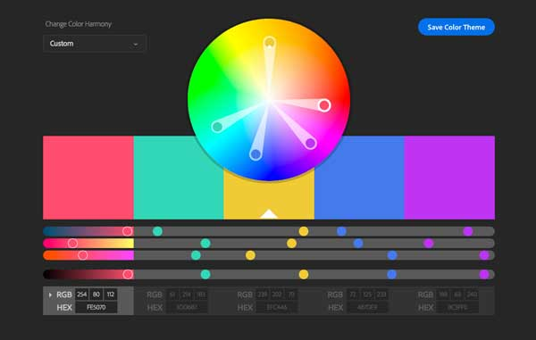

# *-Project Zero-*

atfcreative.com/proj_zero/

==================================

##### Technologies used===>

HTML, CSS, JavaScript, jQuery

===================================

#### Show Psuedo Code=====>




===================================

###Process/ Approach====>

1. Research
[Inspiration](images/snap1.jpg)

2. Decisons
3. Wireframes
[Wireframes](images/snap4.jpg)



4. Colors/Fonts


5. Psuedo Code
6. Code
7. Fix Bugs
8. Respnsive check
8. Media Queries


===================================

##Unsolved Problems====>
* Issues with Navigation, presumably from zed-index inheritance.
* Issues with connecting to API
* Issues with responsiveness


##Wins/Challenges====>

###+ add wire frames, screen shots, code blocks etc.
(see below)

```
//Global vars
var menuButton = document.querySelector('i');
//menu click event listener
menuButton.addEventListener('click', handleMenuClick);
///handle menu click
function handleMenuClick () {
    // console.log('click!');
    var sidebar = document.querySelector('.sidebar');
    if (sidebar.classList.contains('sidebar-hidden')) {
        sidebar.classList.toggle('sidebar-hidden');
        menuButton.style.color = '#000';
        menuButton.classList.remove('fa-bars');
        menuButton.classList.add('fa-times');

    } else {
        sidebar.classList.toggle('sidebar-hidden');
        menuButton.style.color = '#000';
        menuButton.classList.remove('fa-times');
        menuButton.classList.add('fa-bars');
    }
}
```

####Wins-
> Met basic requirements.
> Learned new things about interations, event listeners, DOM manipulation.
> Got carried away with new animation/s abilities etc.

####Challenges ---
> Thinking in a new "programattic" mindset.
> Need to focus on step by step. Strategize and implement.
> Need to focus on breaking the larger problem in to smaller pieces.


